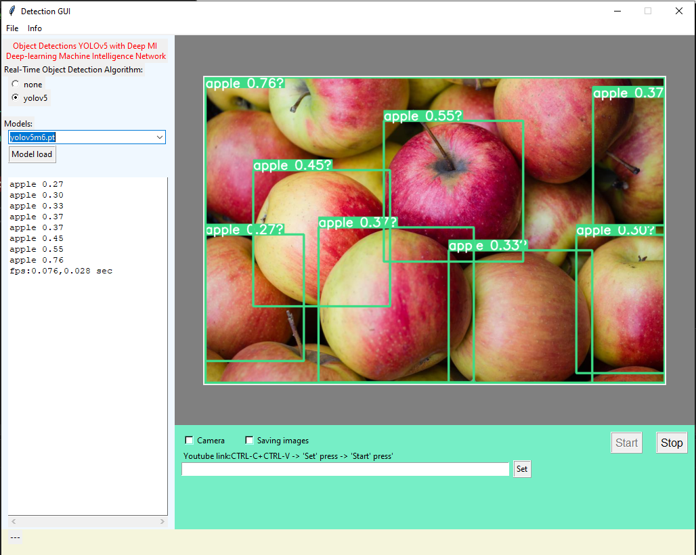

## <div align="center">TiDetection5 GUI with the YOLOv5</div>
Object Detections YOLOv5 with the Deep MI.<br> 
Deep-learning Machine Intelligence Network.<br>
Base is [YOLOv5](https://ultralytics.com/yolov5)


### <div align="center">Installation</div>
Microsoft Visual Studio Community 2022, extension Python 3.9 64 bit.<br>
Open "TIDetection5.sln".
```bash
pip install -r requirements.txt  # install
```
The Installing more packages, this using pip, in the "Python Environments" of Microsoft Visual Studio.

See the [PyTorch Get Started docs](https://pytorch.org/get-started/locally/) for full documentation on installed.

```bash
# GUI
Tkinter
# OpenCV
opencv-contrib-python>=4.6.0.66
# PyTorch + GPU CUDA
torch==1.11.0+cu115 torchvision==0.12.0+cu115 torchaudio==0.11.0 -f https://download.pytorch.org/whl/torch_stable.html
```
I used models of coco dataset [COCO dataset](https://cocodataset.org/#detection-eval)


[TensorRT, TensorFlow Edge TPU and OpenVINO Export and Inference:](https://github.com/ultralytics/yolov5/releases)
```bash
weights -|- yolov5n6.pt
         |- yolov5m6.pt
```
### <div align="center">Tkinder GUI view</div>


](https://www.youtube.com/watch?v=v2rJa8R4g9s)
#### <div align="center">Tkinder feature</div>
1.) Image normal view<br> 
2.) Image detected on a coco dataset view<br> 
3.) Video normal view<br> 
4.) Video detected on a coco dataset view<br> 
5.) Web camera normal view<br> 
6.) Web camera detected on a coco dataset view<br> 
7.) YouTube video detected on a coco dataset view<br> 


